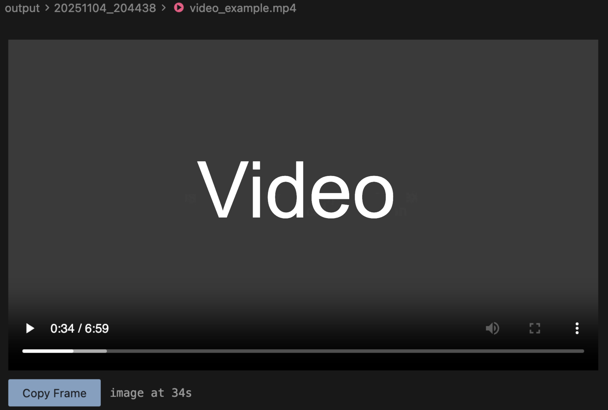

# Frame Copy

VSCode extension to copy video frames with timestamps.



## Usage

1. Open an `.mp4` file in VSCode
2. Click "Copy Frame" button
3. Paste in Claude Code chat
4. Image + timestamp text `[image taken at Xs]` is copied

## Development

```bash
npm install
npm run compile
# Press F5 to launch Extension Development Host
```

## Workflow
1. Open video in VSCode or Cursor
2. Spot issue at timestamp
3. Copy frame → paste it anywhere

## License
MIT
